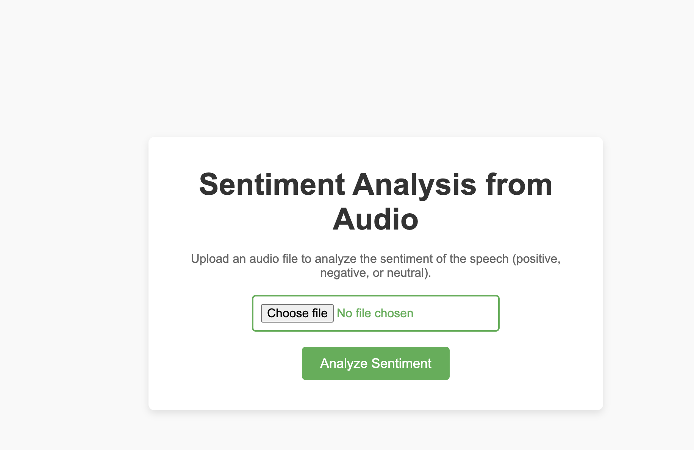
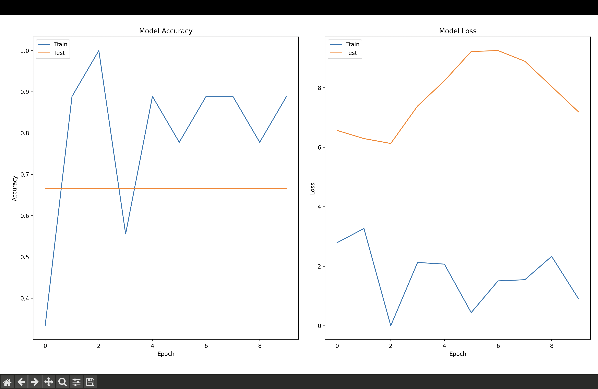
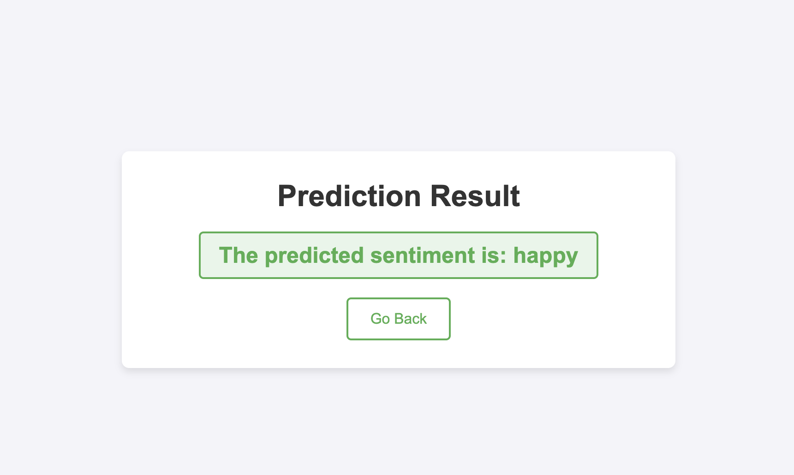
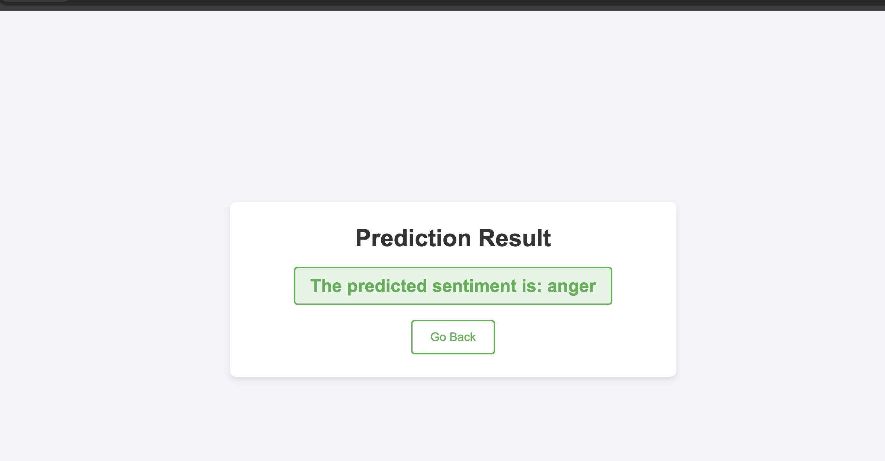

# Emotion Detection using Audio 🎤😃

Welcome to the **Emotion Detection using Audio** project! This is a web-based application that uses a pre-trained deep learning model to predict the emotional state of a person based on the audio file they upload. The supported emotions are: **Happy**, **Anger**, **Sadness**, and **Fear**.
## 🚀 Project Features:
- 🗣️ **Audio-based Emotion Recognition**: Uses audio features (MFCCs) to predict emotions.
- 🖥️ **Web Application**: Built using **Flask** with an easy-to-use interface.
- ⚡ **Fast Processing**: Upload an audio file, and get emotion predictions instantly!
- 📂 **Model Integration**: Utilizes a pre-trained model (`.h5`) to predict emotions.
## ⚙️ Installation & Setup

### Prerequisites:
Make sure you have **Python 3.9+** installed. You'll also need **pip** to install the required dependencies.
🎨 User Interface

###
1. Home Page:
Users can upload an audio file (such as .wav, .mp3) on the home page. Here's a screenshot of the home page:

2. Result Page:
Once the audio is uploaded, the predicted emotion will be displayed on a new page. Here's an example:

💻 Usage Instructions
Upload an Audio File: On the home page, click the "Choose File" button to upload an audio file.
Predict Emotion: Once the file is uploaded, click on the "Predict Emotion" button.
View Result: After processing, the predicted emotion will be displayed on the result page.
Supported emotions:

Happy 😀
Anger 😡
Fear 😨
Sad 😞

Example:
Upload a file named happy_voice.wav.
The model will process it and return the prediction "Happy".

🧑‍💻 Contributing
Contributions are welcome! If you'd like to contribute to this project, please follow these steps:

Fork the repository.
Create a new branch (git checkout -b feature-branch).
Make your changes.
Commit your changes (git commit -am 'Add new feature').
Push to the branch (git push origin feature-branch).
Open a Pull Request.

1. **Plot Section**: I added a section called "Example Plots" where you can show visualizations.

2. **Screenshot Reference**: I included the path to the plot image

3. 

📌 Conclusion
Thank you for exploring the Emotion Detection using Audio project! 🎤😃 This application provides a simple yet powerful way to detect emotions from audio recordings. By leveraging deep learning and audio feature extraction techniques, it allows users to upload audio files and receive emotion predictions based on voice features.

Whether you're building a personal project or just curious about emotion recognition technology, this application provides a straightforward and interactive way to experience emotion detection.

We hope you found this project interesting and useful! Feel free to contribute and improve it further. 😊

📍 Key Takeaways:
Audio-based emotion recognition can be easily integrated into web applications.
Using Flask and a pre-trained model, it’s possible to make real-time emotion predictions based on audio.
The project is highly extensible—feel free to adapt and add new features, such as support for more emotions or other audio-based analysis techniques.